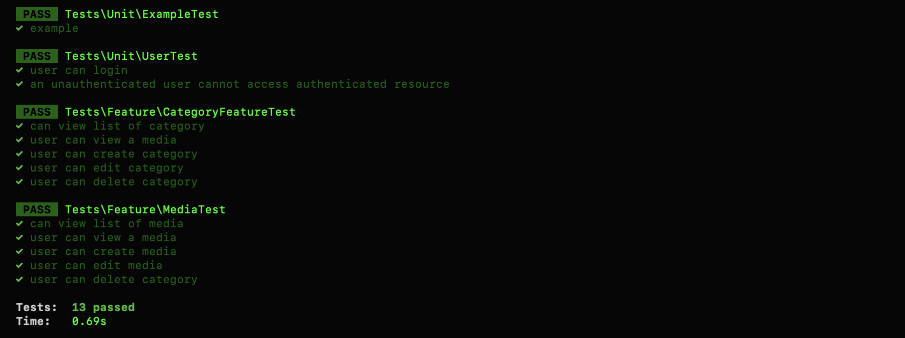

<p align="center">
<a href="https://laravel.com" target="_blank">

</a>
</p>

### EVERY ANGLE

## The application should have the following:
 - Build an application to allow users to curate their own media libraries.
 - The users should be able to:
    * Add, edit and remove media items
    * Categorise media items
    * View media items
 - Must have a GUI or Web UI.
 - Persistent storage is a must.
 - Media types include:
    * Movies
    * Games
    * Music
### Required Techniques
 ### At least one example or equivalent of each of the below:
 - Array or List
 - Loop
 - Method
 - Class
 - Interface
 - Encapsulation
 - Abstraction
 - Comment
 - Inheritance
 - Polymorphism

## Technologies

- PHP 7.4
- Laravel
- Docker

## How to run the application

Below are the steps you need to successfully setup and run the application.
- Clone the app from the repository and cd into the root directory of the app

```
 cp .env.example .env
```

Now, the most important, build and start the package dependencies by running
`composer install`

Composer will start doing its magic. All required dependencies, will be installed.

While composer is doing its magic, you need to add to modify `.env` file:
```
 DB_CONNECTION=mysql
 DB_HOST=127.0.0.1
 DB_PORT=3306
 DB_DATABASE=laravel
 DB_USERNAME=root
 DB_PASSWORD=
```

### To Migrate the database in the project, command below
```
 php artisan migrate --seed
```

While migrating the database, you need to serve the project with this command `php artisan serve`

### How to run tests
```
 php artisan test
```



### Login Details
  * email: admin@admin.com
  * password: password

### Sample Requests
The EveryAngle API gives you access to pretty much all the features you can use on our dashboard and lets you extend them for use in your application. It strives to be RESTful and is organized around the main resources you would be interacting with - with a few notable exceptions.
The Api Collection is located in the application, and it called `EveryAngle.postman_collection.json`
